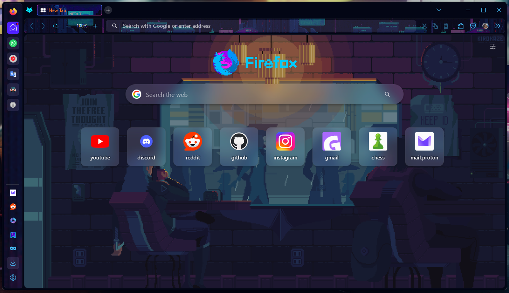

# Firefox-ONE Theme with added pixelated asthetics (animated)

<li> A theme for Opera-ONE Skin Lovers with added asthetics .</li></ul> 

<h3>please support the original work. The gif used in the backgroud is not owned by me</h3>
<h4>the original work --> https://github.com/Godiesc/firefox-one</h4>

## How to install?

<b> Steps to configure the theme:</b>
<ol>
   <li>Tap at the code icon and in the drop down click install zip.</li> 
   <li>Unzip the file and copy the 👉<code>chrome</code>👈 folder and the 👉<code>user.js</code>👈 file into your Firefox profile directory. To find out the location of your profile directory go to <a href="https://github.com/Godiesc/firefox-one#example-of-aboutsupport"> about:support</a> or about:profiles.</li>
   <li>Install and use a compatible theme.</li>
   <li>Restart the browser.</li>
</ol>
 

<h2>the wallpaper (included) (not mine!)</h2>
<h3>here is the source</h3>
<h3>https://www.reddit.com/r/perfectloops/comments/9376vf/smoke_in_the_rain/</h3>

<h4>If you have anything to do with this and would like me to cite you a credit, please reach out. The user in the given reddit (source for the image) link has been suspended</h4>

## Theme to go with it

<a href= "https://addons.mozilla.org/en-US/firefox/addon/next-gen-gaming-rainy-night/">Next-Gen-gaming-rainy-night</a> 
 
<h3>other themes are compatable aswell, the above theme is to match the description</h3>

## Important Information 💎

<b>Notice:</b>

<ul>
<li>You can use flexible spaces to create separatos in the tabs-bar.</li>
<li>For Left-sidebar the theme use the bookmarks bar, so it should be always on.</li>
<li>The social extensions used to put in the left-sidebar are: 

</li>
<h4>to use the above extention in sidebar, pin the extention to toolbar and drag to the side bar</h4>
<li>For themes that use 2 or more images, the background of the selected tab will show a empty border on the right, to solve that you should change the line <code>32</code> in <code>one_root-personal.css</code> file with <code>--display-theme-with-images: 50vw;</code>
</li>
</ul>

## Optional Features

For the next features you need to create the rules in <b>about:config</b> page.

<ul>
<li><a href="https://github.com/Godiesc/firefox-one/tree/main/Previews#left-sidebar-disabled">Left-sidebar disabled</a></li>
<table><tr>
    <td width="320px">firefoxone.style_without_leftsidebar</td>
    <td width="50px">true</td></tr>
</table>
<li><a href="https://github.com/Godiesc/firefox-one/tree/main/Previews#default-colors-disabled">Default colors disabled</a></li>
<table><tr>
    <td width="320px">firefoxone.without-default-colors</td>
    <td width="50px">true</td></tr>
</table>
<li><a href="https://github.com/Godiesc/firefox-one/tree/main/Previews#tree-tabs-style-enabled---eg-tab-center-reborn">Tree-tabs-style</a> (e.g. <a href="https://addons.mozilla.org/es/firefox/addon/tabcenter-reborn/">Tab-center-reborn</a>) </li>
<table><tr>
    <td width="320px">firefoxone.tree_tabs_style</td>
    <td width="50px">true</td></tr>
</table>
<li><a href="https://github.com/Godiesc/firefox-one/tree/main/Previews#tree-tabs-style-enabled-and-left-sidebar-disabled">Tree-tabs-style without Left-sidebar</a></li>
   <table><tr>
    <td width="320px">firefoxone.tree_tabs_style</td>
    <td width="50px">true</td></tr>
   <tr>
    <td width="320px">firefoxone.style_without_leftsidebar</td>
    <td width="50px">true</td></tr>
</table>
<li><a href="https://github.com/Godiesc/firefox-one/tree/main/Previews#selected-tab-gradient-border">Selected tab gradient border</a></li>
<table><tr>
    <td width="320px">firefoxone.selected_tab_gradient_border</td>
    <td width="50px">true</td></tr>
</table>
<li><a href="https://github.com/Godiesc/firefox-one/tree/main/Previews#image-in-menus">Image in menus</a></li>
<table><tr>
    <td width="320px">firefoxone.image_in_menus</td>
    <td width="50px">true</td></tr>
</table>
<li><a href="https://github.com/Godiesc/firefox-one/tree/main/Previews#main-image">Main-image</a></li>
<table><tr>
    <td width="320px">firefoxone.main-image</td>
    <td width="50px">true</td></tr>
</table> 
<li><a href="https://github.com/Godiesc/firefox-one/blob/main/Previews/README.md#rhythm-image-for-tab-with-sound">Rhythm image for tab with sound</a></li>
<table><tr>
    <td width="320px">firefoxone.rhythm_sound_tab</td>
    <td width="50px">true</td></tr>
</table>   
</ul>

